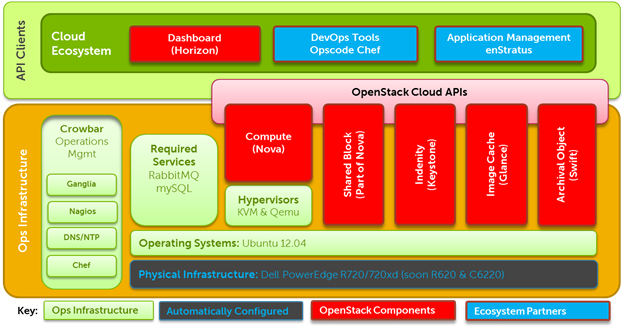

**Dell OpenStack Powered Cloud Solution Deployment Guide**

THIS DOCUMENT IS PROVIDED UNDER AN APACHE 2 LICENSE

**Notes, Cautions, and Warnings**

NOTE: A NOTE indicates important information that helps you make better
use of your system.

CAUTION: A CAUTION indicates potential damage to hardware or loss of
data if \
 instructions are not followed.

WARNING: A WARNING indicates a potential for property damage, personal \
 injury, or death.

_____________________________________________________________________________________

**Information in this document is subject to change without notice.\
2012 Dell Inc.
**

Reproduction of these materials is allowed under the Apache 2 license.

Trademarks used in this text: Dell, the DELL logo, OpenStack ,
Nagios, Ganglia, Opscode Chef, Canonical Ubuntu , VMWare

Other trademarks and trade names may be used in this publication to
refer to either the entities claiming the marks and names or their
products. Dell Inc. disclaims any proprietary interest in trademarks and
trade names other than its own.

Contents

[1 OpenStack Deployment Procedure. 4](#_Toc329001004)

[2 Site Preparation and Hardware Installation. 4](#_Toc329001005)

[2.1 Hardware Setup. 4](#_Toc329001006)

[2.2 Bootstrap Node. 5](#_Toc329001007)

[2.3 Administration Node. 5](#_Toc329001008)

[2.4 Switch Configuration. 5](#_Toc329001009)

[2.5 Additional Site Preparation. 5](#_Toc329001010)

[3 Administration Node Setup. 5](#_Toc329001011)

[3.1 Installing the Admin Node Operating System and Software.
6](#_Toc329001012)

[3.2 Network Configuration. 8](#_Toc329001013)

[3.2.1 Logical Network Configuration. 8](#_Toc329001014)

[3.2.2 Changing the network configuration. 9](#_Toc329001015)

[3.2.3 Network configuration options. 9](#_Toc329001016)

[3.2.4 Adding External Access to the Admin Node.
11](#_Toc329001017)

[3.2.5 Configuring the Network for Outbound Connectivity.
12](#_Toc329001018)

[3.3 Installing Crowbar. 14](#_Toc329001019)

[3.3.1 Verifying Admin Node Status. 14](#_Toc329001020)

[3.4 Discovering and Allocating Additional Nodes.
18](#_Toc329001021)

[4 Installing OpenStack Components. 18](#_Toc329001022)

[4.1 Example: Implementing a Proposal via Cmd. Line.
19](#_Toc329001023)

[4.1.1 Obtain a Proposal19](#_Toc329001024)

[4.1.2 Update a Proposal19](#_Toc329001025)

[4.1.3 Committing a Proposal20](#_Toc329001026)

[4.1.4 Modifying an Active Configuration. 20](#_Toc329001027)

[5 Appendix A: Default Switch Configuration. 21](#_Toc329001028)

[6 Appendix B: Sample Network Configuration JSON..
23](#_Toc329001029)

[7 Appendix C: End User License Agreement. 27](#_Toc329001030)

****

1 OpenStack Deployment Procedure
========================================

This guide provides the information necessary to deploy the Dell
OpenStack Powered Cloud Solution. It is intended to be used in
conjunction with the Dell OpenStack Powered Cloud Solution Reference
Architecture Guide, the Dell OpenStack Powered Cloud Solution Barclamps
User Guide, and the Dell Crowbar Users Guide.

Deployment consists of the following steps:

1. Site preparation and hardware installation

2. Administration node setup, including network configuration and
Crowbar installation.

3. OpenStack deployment using Crowbar.

When the deployment is complete, the complete Dell OpenStack Powered
Cloud Solution will be installed, as shown in Figure 1.

Figure 1 OpenStack Solution Taxonomy

2 Site Preparation and Hardware Installation
====================================================

2.1 Hardware Setup
--------------------------

All systems should be installed and cabled according the physical
configurations detailed in the Dell OpenStack Powered Cloud Solution
Reference Architecture Guide.

Estimate the electrical power and cooling usage using the Dell Energy
Smart Solution Advisor:
[http://www.dell.com/content/topics/topic.aspx/global/products/pedge/topics/en/config\_calculator?c=us&cs=555&l=en&s=biz](http://www.dell.com/content/topics/topic.aspx/global/products/pedge/topics/en/config_calculator?c=us&cs=555&l=en&s=biz)

You can use this tool to plan the appropriate PDU and ensure the cooling
is adequate.

2.2 Bootstrap Node
--------------------------

The initial setup of the administration node will require a temporary
bootstrap node, such as a laptop. The administration node will also
need a keyboard, and monitor (or KVM connection) during initial
installation.

The bootstrap node will be used to perform the initial PXE boot of the
administration node. It must have VMWare player installed to start the
bootstrap process, and will be connected to the administration node via
a crossover network cable.

2.3 Administration Node
-------------------------------

The hardware on the admin node should be configured as follows:

 **Boot sequence:** BIOS is set to boot from local disk. Note
that this is the normal operating setting, but for its initial setup
boot, the admin node will need to boot from network in order to
bootstrap the installation from the VMPlayer image running on the
bootstrap node.

 **RAID controller:** All disks should be in a RAID 10
configuration.

BMC and networking settings for the nodes are configured using Crowbar,
and manual steps are not required.

2.4 Switch Configuration
--------------------------------

The network switches should be configured appropriately before beginning
the installation. The installation process does not configure the
switches. A typical configuration using Dell PowerConnect 6248 switches
is included in Appendix A: Default Switch Configuration.

If the network configuration differs from the standard one described in
the Reference Architecture, this configuration must be updated.

2.5 Additional Site Preparation
---------------------------------------

Solution deployment may need additional preparation.

The Reference Architecture does not specify any firewalls or
load-balancers  if these are required, they should be configured at
this time.

Also, a bastion host, installed behind appropriate site-specific
security systems, can be used to access the administration node and
cloud remotely. Direct access to the admin, internal, and external
networks should not be configured without appropriate security
procedures.

3 Administration Node Setup
===================================

The admin node must be configured first. Installing the admin node
involves installing the base operating system, optionally customizing
the Crowbar configuration (primarily the networking configuration,) and
installing Crowbar itself.

Once configured, Crowbar running on the admin node is used to configure
and deploy the rest of the solution, and to provide ongoing operations
management. The admin node manages all the cluster compute and storage
nodes. It assigns the other nodes IP addresses; PXE boots them,
configures them, and provides them the necessary software for their
roles. To provide these services, the admin node runs the services
listed in Table 1. The admin node must be the only DHCP server visible
to the compute and storage nodes.

 <table border="1">
      <tbody>
        <tr>
          <td>**Crowbar Server**</td>
          <td> Manages all nodes, supplying configuration of hardware and
            software. </td>
        </tr>
        <tr>
          <td>**Chef Server** 
          </td>
          <td>Manages many of the software packages and allows the easy changing
            of nodes.  
          </td>
        </tr>
       <tr>
          <td>**DHCP server** 
          </td>
          <td>Assigns and manages IPs for the compute and storage nodes. The
            admin node must be the only DHCP server visible to the compute and
            storage nodes. 
          </td>
        </tr>
        <tr>
          <td>**NTP server ** 
          </td>
          <td>Synchronizes all nodes are to the same time reference. 
          </td>
        </tr>
        <tr>
          <td>**TFTP server** 
          </td>
          <td>PXE boots compute and storage nodes with a Linux kernel. The TFTP
            server services any PXE boot request it receives with its default
            options 
          </td>
        </tr>
        <tr>
          <td>**DNS server** 
          </td>
          <td>Manages the name resolution for the nodes and can be configured to provide external
            name forwarding 
          </td>f
        </tr>
      </tbody>
    </table>

 

3.1 Installing the Admin Node Operating System and Software
----------------------------------------------------------------------------

The initial admin node installation is performed by PXE booting the
admin node from a bootstrap node, typically a laptop. The steps are:

1.  Power on the admin node, and ensure that: 
    a.  It is set up to boot from the hard disk for subsequent boots. 
    b.  This first boot (and <u>only</u> this first boot) is a network boot.

2.  Power off the admin node.
3.  Make sure you have VMWare Player[[1]](#_ftn1) installed on the
    laptop.
4.  Make sure you have the Crowbar ISO image loaded on the laptop.
5.  Turn off or disable wireless networking on the laptop.
6.  Open the VMware machine configuration distributed with Crowbar (this
    will be a .vmx file).
7.  Edit the machine settings within Player and ensure that the network
    adapter is configured to use Bridged Networking (see Figure 3),
    connected to the physical network adapter.
8.  Configure VMWare player to mount the Crowbar ISO image a DVD in the
    VM (see Figure 2.)
9.  Connect the network crossover cable between eth0 of the admin node
    the network port of the laptop.
10. Power on the VM  it should boot and present a login prompt in under
    a minute.
11. Power on the admin node. It should PXE boot, obtaining its image
    from the VM.
12. The admin node will automatically install its operating system and
    deployment software.
13. Once the installation is complete, power down the installer VM, and
    disconnect the laptop
14. Reconnect eth0 of the admin node to the appropriate switch port.

When this process has completed, the operating system and deployment
software has been installed on the admin node. The Crowbar software has
been copied to the admin node, but final installation has not been
completed.

 Figure 2 VMWare Player configuration for ISO boot

 Figure 3 VMWare Player configuration for network bridging

3.2 Network Configuration
---------------------------------

### 3.2.1 Logical Network Configuration

Crowbar manages the network settings for the deployment using the
network Barclamp. The base networking configuration has been architected
to maintain a logical segregation of traffic, with minimal
configuration. There are several logical networks defined, segmented
into separate vLANs as shown in Table 2.

The Crowbar network configuration can be customized to support site
specific networking needs and conventions. These changes include adding
additional vLANs, changing vLAN mappings, changing IP address range
assignments, and teaming NICs.

If changes are required, they must be done at this point, before the
final Crowbar installation.

  <table cellspacing="0" cellpadding="0" border="1" class="MsoNormalTable" style="border-collapse:collapse;border:none">
      <tbody>
        <tr>
          <td valign="top" style="border-top:solid #4F81BD 1.0pt;border-left:none;   border-bottom:solid #4F81BD 1.0pt;border-right:none;padding:0in 5.4pt 0in 5.4pt">
            
<a
                href="http://10.208.66.122:3389/twiki/bin/view/Main/NetworkBarclamp?sortcol=0;table=5;up=0#sorted_table"
                title="Sort by this column"><b>Name</b></a><b></b>

          </td>
          <td valign="top" style="border-top:solid #4F81BD 1.0pt;border-left:none;   border-bottom:solid #4F81BD 1.0pt;border-right:none;padding:0in 5.4pt 0in 5.4pt">
            
<a
                href="http://10.208.66.122:3389/twiki/bin/view/Main/NetworkBarclamp?sortcol=1;table=5;up=0#sorted_table"
                title="Sort by this column"><b>Usage</b></a><b></b>

          </td>
          <td valign="top" style="border-top:solid #4F81BD 1.0pt;border-left:none;   border-bottom:solid #4F81BD 1.0pt;border-right:none;padding:0in 5.4pt 0in 5.4pt">
            
<a
                href="http://10.208.66.122:3389/twiki/bin/view/Main/NetworkBarclamp?sortcol=2;table=5;up=0#sorted_table"
                title="Sort by this column"><b>Notes</b></a><b></b>

          </td>
        </tr>
        <tr>
          <td valign="top" style="border:none;background:#D3DFEE;padding:0in 5.4pt 0in 5.4pt">
            
<b>admin </b>

          </td>
          <td valign="top" style="border:none;background:#D3DFEE;padding:0in 5.4pt 0in 5.4pt">
            
Private network for node to node
                communication 

          </td>
          <td valign="top" style="border:none;background:#D3DFEE;padding:0in 5.4pt 0in 5.4pt">
            
A router, if wanted, is external to the
                system. This network must be owned by the crowbar system to run
                DHCP on. 

          </td>
        </tr>
        <tr>
          <td valign="top" style="border:none;padding:0in 5.4pt 0in 5.4pt">
            
<b>bmc </b>

          </td>
          <td valign="top" style="border:none;padding:0in 5.4pt 0in 5.4pt">
            
Private network for bmc communication 

          </td>
          <td valign="top" style="border:none;padding:0in 5.4pt 0in 5.4pt">
            
This can be the same as the admin network
                by using the ranges to limit what IP goes where. A router, if
                wanted, is external to the system. 

          </td>
        </tr>
        <tr>
          <td valign="top" style="border:none;background:#D3DFEE;padding:0in 5.4pt 0in 5.4pt">
            
<b>bmc_vlan </b>

          </td>
          <td valign="top" style="border:none;background:#D3DFEE;padding:0in 5.4pt 0in 5.4pt">
            
Private network for admin nodes on the bmc
                network 

          </td>
          <td valign="top" style="border:none;background:#D3DFEE;padding:0in 5.4pt 0in 5.4pt">
            
This must be the same as the bmc network
                and have the same vlan. This will be used to generate a vlan
                tagged interface on the admin nodes that can access the bmc lan.
              

          </td>
        </tr>
        <tr>
          <td valign="top" style="border:none;padding:0in 5.4pt 0in 5.4pt">
            
<b>storage </b>

          </td>
          <td valign="top" style="border:none;padding:0in 5.4pt 0in 5.4pt">
            
Private network for storage traffic 

          </td>
          <td valign="top" style="border:none;padding:0in 5.4pt 0in 5.4pt">
            
A router, if wanted, is external to the
                system 

          </td>
        </tr>
        <tr>
          <td valign="top" style="border:none;background:#D3DFEE;padding:0in 5.4pt 0in 5.4pt">
            
<b>public </b>

          </td>
          <td valign="top" style="border:none;background:#D3DFEE;padding:0in 5.4pt 0in 5.4pt">
            
Public network for crowbar and other
                components 

          </td>
          <td valign="top" style="border:none;background:#D3DFEE;padding:0in 5.4pt 0in 5.4pt">
            
A router, if wanted, is external to the
                system. 

          </td>
        </tr>
        <tr>
          <td valign="top" style="border:none;padding:0in 5.4pt 0in 5.4pt">
            
<b>nova_fixed </b>

          </td>
          <td valign="top" style="border:none;padding:0in 5.4pt 0in 5.4pt">
            
Public network for nova Virtual Machines 

          </td>
          <td valign="top" style="border:none;padding:0in 5.4pt 0in 5.4pt">
            
The nova-network node acts as a router.
                This must be completely owned by the nova system. 

          </td>
        </tr>
        <tr>
          <td valign="top" style="border:none;border-bottom:solid #4F81BD 1.0pt;   background:#D3DFEE;padding:0in 5.4pt 0in 5.4pt">
            
<b>nova_floating</b>

          </td>
          <td valign="top" style="border:none;border-bottom:solid #4F81BD 1.0pt;   background:#D3DFEE;padding:0in 5.4pt 0in 5.4pt">
            
Used for external access to
                nova virtual machines

          </td>
          <td valign="top" style="border:none;border-bottom:solid #4F81BD 1.0pt;   background:#D3DFEE;padding:0in 5.4pt 0in 5.4pt">
            
 

             
          </td>
        </tr>
      </tbody>
    </table>
    
Table </a>2 Logical Network Definitions

### 3.2.2 Changing the network configuration

The network configuration is defined by the Crowbar network Barclamp.
The details are specified in a text file in JSON[[2]](#_ftn2) format.
This file can be edited to change many parameters in the network
configuration. After making the changes, the final Crowbar installation
can be completed (see section 3.2.4, Installing Crowbar.)

The configuration file is on the admin node, with the pathname:

	/opt/dell/barclamps/network/chef/data\_bags/crowbar/bc-template-network.json

When editing the file, be careful with the syntax, particularly with
commas. A common mistake is to add trailing commas at the end of
sections. The file is validated at Crowbar installation time. If there
are errors, the Crowbar installation will fail, and the log files will
contain a reference to the error.

### 3.2.3 Network configuration options

The JSON configuration file is divided into several sections. This
document contains a summary of the options for convenience. For more
details, refer to the network Barclamp section in the Dell Crowbar Users
Guide.

Refer to the sample JSON file in Appendix B: Sample Network
Configuration JSON or the file on disk to see the actual file syntax.

#### 3.2.3.1 Attributes

This section contains global settings for the network configuration.

**<table class="MsoNormalTable" style="border-collapse:collapse;border:none" border="1"
      cellpadding="0" cellspacing="0">
      <tbody>
        <tr>
          <td style="border-top:solid #4F81BD 1.0pt;border-left:none;   border-bottom:solid #4F81BD 1.0pt;border-right:none;padding:0in 5.4pt 0in 5.4pt"
            valign="top">
            
<a
                href="http://10.208.66.122:3389/twiki/bin/view/Main/NetworkBarclamp?sortcol=0;table=1;up=0#sorted_table"
                title="Sort by this column"><b>Name</b></a><b></b>

          </td>
          <td style="border-top:solid #4F81BD 1.0pt;border-left:none;   border-bottom:solid #4F81BD 1.0pt;border-right:none;padding:0in 5.4pt 0in 5.4pt"
            valign="top">
            
<a href="http://10.208.66.122:3389/twiki/bin/view/Main/NetworkBarclamp?sortcol=1;table=1;up=0#sorted_table"
                title="Sort by this column"><b>Default</b></a><b></b>

          </td>
          <td style="border-top:solid #4F81BD 1.0pt;border-left:none;   border-bottom:solid #4F81BD 1.0pt;border-right:none;padding:0in 5.4pt 0in 5.4pt"
            valign="top">
            
<a href="http://10.208.66.122:3389/twiki/bin/view/Main/NetworkBarclamp?sortcol=2;table=1;up=0#sorted_table"
                title="Sort by this column"><b>Description</b></a><b></b>

          </td>
        </tr>
        <tr>
          <td style="border:none;background:#D3DFEE;padding:0in 5.4pt 0in 5.4pt"
            valign="top">
            
<b>start_up_delay </b>

          </td>
          <td style="border:none;background:#D3DFEE;padding:0in 5.4pt 0in 5.4pt"
            valign="top">
            
30 

          </td>
          <td style="border:none;background:#D3DFEE;padding:0in 5.4pt 0in 5.4pt"
            valign="top">
            
Used to provide a delay in seconds, so the
                spanning tree in the switch can settle when new interfaces are
                brought up. 

          </td>
        </tr>
        <tr>
          <td style="border:none;padding:0in 5.4pt 0in 5.4pt" valign="top">
            
<b>mode </b>

          </td>
          <td style="border:none;padding:0in 5.4pt 0in 5.4pt" valign="top">
            
single 

          </td>
          <td style="border:none;padding:0in 5.4pt 0in 5.4pt" valign="top">
            
This controls whether single or teamed
                (bonded) NICS are used (it actually defines which conduit map is
                used)

          </td>
        </tr>
        <tr>
          <td style="border:none;border-bottom:solid #4F81BD 1.0pt;   background:#D3DFEE;padding:0in 5.4pt 0in 5.4pt"
            valign="top">
            
<b>teaming </b>

          </td>
          <td style="border:none;border-bottom:solid #4F81BD 1.0pt;   background:#D3DFEE;padding:0in 5.4pt 0in 5.4pt"
            valign="top">
            
6 

          </td>
          <td style="border:none;border-bottom:solid #4F81BD 1.0pt;   background:#D3DFEE;padding:0in 5.4pt 0in 5.4pt"
            valign="top">
            
Determines the Linux teaming mode used 

          </td>
        </tr>
      </tbody>
    </table>

#### 3.2.3.2 Interface Maps

This section specifies the hardware bus order used to define eth0, eth1,
etc., on particular hardware systems. This rarely needs to be changed,
unless a particular system is not correctly enumerating network
controllers in the correct order.

#### 4.2.3.3 Conduit Maps and Lists

The Crowbar network Barclamp uses an abstraction, called a conduit, to
map hardware network interfaces into logical interfaces. This section
defines the logical conduit names (intf0, intf2, etc.,) and the
interfaces in the conduit. The interfaces are defined by the type of
network interface card (NIC.) 1g refers to a 1 GBit network interfaces,
10g refers to a 10 GBit network interface.

#### 4.2.3.4 Networks

The network section defines the individual networks. Each subsection
specifies the network name, its VLAN assignments, and the IP parameters.

The networks section is the one which is most commonly edited to change
vlan assignments and IP address parameters. Each network has the
following parameters:

<table class="MsoNormalTable" border="1" cellspacing="0" cellpadding="0"
style="border-collapse:collapse;border:none">
  <tbody>
    <tr>
      <td valign="top"
      style="border-top:solid #4F81BD 1.0pt;border-left:none;   border-bottom:solid #4F81BD 1.0pt;border-right:none;padding:0in 5.4pt 0in 5.4pt">
<a
        href="http://10.9.244.31:3389/twiki/bin/view/Main/NetworkBarclamp?sortcol=0;table=3;up=0#sorted_table"
        title="Sort by this column"><b>Name</b></a><b></b>

      </td>
      <td valign="top"
      style="border-top:solid #4F81BD 1.0pt;border-left:none;   border-bottom:solid #4F81BD 1.0pt;border-right:none;padding:0in 5.4pt 0in 5.4pt">
<a
        href="http://10.9.244.31:3389/twiki/bin/view/Main/NetworkBarclamp?sortcol=1;table=3;up=0#sorted_table"
        title="Sort by this column"><b>Default</b></a><b></b>

      </td>
      <td valign="top"
      style="border-top:solid #4F81BD 1.0pt;border-left:none;   border-bottom:solid #4F81BD 1.0pt;border-right:none;padding:0in 5.4pt 0in 5.4pt">
<a
        href="http://10.9.244.31:3389/twiki/bin/view/Main/NetworkBarclamp?sortcol=2;table=3;up=0#sorted_table"
        title="Sort by this column"><b>Description</b></a><b></b>

      </td>
    </tr>
    <tr>
      <td valign="top"
      style="border:none;background:#D3DFEE;padding:0in 5.4pt 0in 5.4pt">
<b>vlan </b>

      </td>
      <td width="68" valign="top"
      style="width:50.7pt;border:none;background:#D3DFEE;   padding:0in 5.4pt 0in 5.4pt">
Integer 

      </td>
      <td width="487" valign="top"
      style="width:365.4pt;border:none;background:#D3DFEE;   padding:0in 5.4pt 0in 5.4pt">
The VLAN ID to use on the switch and interfaces
        for this network 

      </td>
    </tr>
    <tr>
      <td valign="top" style="border:none;padding:0in 5.4pt 0in 5.4pt">
<b>use_vlan </b>

      </td>
      <td width="68" valign="top"
      style="width:50.7pt;border:none;padding:0in 5.4pt 0in 5.4pt">
true 

      </td>
      <td width="487" valign="top"
      style="width:365.4pt;border:none;padding:0in 5.4pt 0in 5.4pt">
A value of true enables VLAN tagging.  A value
        of false assumes that the node will receive untagged traffic for this
        network. 

      </td>
    </tr>
    <tr>
      <td valign="top"
      style="border:none;border-bottom:solid #4F81BD 1.0pt;   background:#D3DFEE;padding:0in 5.4pt 0in 5.4pt">
<b>add_bridge </b>

      </td>
      <td width="68" valign="top"
      style="width:50.7pt;border:none;border-bottom:solid #4F81BD 1.0pt;   background:#D3DFEE;padding:0in 5.4pt 0in 5.4pt">
false 

      </td>
      <td width="487" valign="top"
      style="width:365.4pt;border:none;border-bottom:solid #4F81BD 1.0pt;   background:#D3DFEE;padding:0in 5.4pt 0in 5.4pt">
indicates if the network should have a bridge
        built on top of it. The bridge will be brnnn. This is used for Nova
        compute nodes. 

      </td>
    </tr>
  </tbody>
</table>

 

<table class="MsoNormalTable" border="1" cellspacing="0" cellpadding="0"
style="border-collapse:collapse;border:none">
  <tbody>
    <tr>
      <td valign="top"
      style="border-top:solid #4F81BD 1.0pt;border-left:none;   border-bottom:solid #4F81BD 1.0pt;border-right:none;padding:0in 5.4pt 0in 5.4pt">
<b>subnet </b>

      </td>
      <td width="68" valign="top"
      style="width:50.7pt;border-top:solid #4F81BD 1.0pt;   border-left:none;border-bottom:solid #4F81BD 1.0pt;border-right:none;   padding:0in 5.4pt 0in 5.4pt">
<b>IP Address </b>

      </td>
      <td width="487" valign="top"
      style="width:365.4pt;border-top:solid #4F81BD 1.0pt;   border-left:none;border-bottom:solid #4F81BD 1.0pt;border-right:none;   padding:0in 5.4pt 0in 5.4pt">
<b>The subnet for this network </b>

      </td>
    </tr>
    <tr>
      <td valign="top"
      style="border:none;background:#D3DFEE;padding:0in 5.4pt 0in 5.4pt">
<b>netmask </b>

      </td>
      <td width="68" valign="top"
      style="width:50.7pt;border:none;background:#D3DFEE;   padding:0in 5.4pt 0in 5.4pt">
Netmask 

      </td>
      <td width="487" valign="top"
      style="width:365.4pt;border:none;background:#D3DFEE;   padding:0in 5.4pt 0in 5.4pt">
The netmask for this network 

      </td>
    </tr>
    <tr>
      <td valign="top" style="border:none;padding:0in 5.4pt 0in 5.4pt">
<b>router </b>

      </td>
      <td width="68" valign="top"
      style="width:50.7pt;border:none;padding:0in 5.4pt 0in 5.4pt">
IP Address 

      </td>
      <td width="487" valign="top"
      style="width:365.4pt;border:none;padding:0in 5.4pt 0in 5.4pt">
The default router for this network 

      </td>
    </tr>
    <tr>
      <td valign="top"
      style="border:none;background:#D3DFEE;padding:0in 5.4pt 0in 5.4pt">
<b>broadcast </b>

      </td>
      <td width="68" valign="top"
      style="width:50.7pt;border:none;background:#D3DFEE;   padding:0in 5.4pt 0in 5.4pt">
IP Address 

      </td>
      <td width="487" valign="top"
      style="width:365.4pt;border:none;background:#D3DFEE;   padding:0in 5.4pt 0in 5.4pt">
The default broadcast address for this network
        

      </td>
    </tr>
    <tr>
      <td valign="top"
      style="border:none;border-bottom:solid #4F81BD 1.0pt;   padding:0in 5.4pt 0in 5.4pt">
<b>ranges </b>

      </td>
      <td width="68" valign="top"
      style="width:50.7pt;border:none;border-bottom:solid #4F81BD 1.0pt;   padding:0in 5.4pt 0in 5.4pt">
map 

      </td>
      <td width="487" valign="top"
      style="width:365.4pt;border:none;border-bottom:solid #4F81BD 1.0pt;   padding:0in 5.4pt 0in 5.4pt">
This contains a map of strings to start and stop
        values for network. This allows for sub-ranges with the network for
        specific uses. e.g. dhcp, admin, bmc, hosts. 

      </td>
    </tr>
  </tbody>
</table>

The range map has a string key that is the name and map defining the
range.
 

<table class="MsoNormalTable" border="1" cellspacing="0" cellpadding="0"
style="border-collapse:collapse;border:none">
  <tbody>
    <tr>
      <td valign="top"
      style="border-top:solid #4F81BD 1.0pt;border-left:none;   border-bottom:solid #4F81BD 1.0pt;border-right:none;padding:0in 5.4pt 0in 5.4pt">
<a
        href="http://10.208.66.122:3389/twiki/bin/view/Main/NetworkBarclamp?sortcol=0;table=4;up=0#sorted_table"
        title="Sort by this column"><b>Name</b></a><b></b>

      </td>
      <td valign="top"
      style="border-top:solid #4F81BD 1.0pt;border-left:none;   border-bottom:solid #4F81BD 1.0pt;border-right:none;padding:0in 5.4pt 0in 5.4pt">
<a
        href="http://10.208.66.122:3389/twiki/bin/view/Main/NetworkBarclamp?sortcol=1;table=4;up=0#sorted_table"
        title="Sort by this column"><b>Type</b></a><b></b>

      </td>
      <td valign="top"
      style="border-top:solid #4F81BD 1.0pt;border-left:none;   border-bottom:solid #4F81BD 1.0pt;border-right:none;padding:0in 5.4pt 0in 5.4pt">
<a
        href="http://10.208.66.122:3389/twiki/bin/view/Main/NetworkBarclamp?sortcol=2;table=4;up=0#sorted_table"
        title="Sort by this column"><b>Description</b></a><b></b>

      </td>
    </tr>
    <tr>
      <td valign="top"
      style="border:none;background:#D3DFEE;padding:0in 5.4pt 0in 5.4pt">
<b>start </b>

      </td>
      <td valign="top"
      style="border:none;background:#D3DFEE;padding:0in 5.4pt 0in 5.4pt">
IP Address 

      </td>
      <td valign="top"
      style="border:none;background:#D3DFEE;padding:0in 5.4pt 0in 5.4pt">
First address in the range, inclusive 

      </td>
    </tr>
    <tr>
      <td valign="top"
      style="border:none;border-bottom:solid #4F81BD 1.0pt;   padding:0in 5.4pt 0in 5.4pt">
<b>end </b>

      </td>
      <td valign="top"
      style="border:none;border-bottom:solid #4F81BD 1.0pt;   padding:0in 5.4pt 0in 5.4pt">
IP Address 

      </td>
      <td valign="top"
      style="border:none;border-bottom:solid #4F81BD 1.0pt;   padding:0in 5.4pt 0in 5.4pt">
Last address in the range, inclusive 

      </td>
    </tr>
  </tbody>
</table>

 

*#### 4.2.3.5 Example network definition*

This is a sample network definition stanza, for an admin network.

 
<tt>1&nbsp;&nbsp;&nbsp;
            "admin": {</tt>

    
<tt>2
           &nbsp;&nbsp;&nbsp; "vlan":
        100,</tt>

    
<tt>3
           &nbsp;&nbsp;&nbsp; "use_vlan": false,</tt>

    
<tt>4
           &nbsp;&nbsp;&nbsp; "add_bridge": false,</tt>

    
<tt>5
          &nbsp;&nbsp;&nbsp; "subnet": "192.168.124.0",</tt>

    
<tt>6
           &nbsp;&nbsp;&nbsp; "netmask": "255.255.255.0",</tt>

    
<tt>7&nbsp;&nbsp; &nbsp; 
        "broadcast": "192.168.124.255",</tt>

    
<tt>8
           &nbsp;&nbsp;&nbsp; "ranges": {</tt>

    
<tt>9
           &nbsp;&nbsp;&nbsp; &nbsp;&nbsp;&nbsp; "admin"</tt>

    
<tt>10
           &nbsp;&nbsp;&nbsp; &nbsp;&nbsp;&nbsp;
        &nbsp;&nbsp;&nbsp; { "start": "192.168.124.10",
        "end": "192.168.124.11" },</tt>

    
<tt>11
           &nbsp;&nbsp;&nbsp; &nbsp;&nbsp;&nbsp;
        "dhcp"</tt>

    
<tt>12
           &nbsp;&nbsp;&nbsp; &nbsp;&nbsp;&nbsp;
        &nbsp;&nbsp;&nbsp; { "start": "192.168.124.21",
        "end": "192.168.124.80" },</tt>

    
<tt>13
           &nbsp;&nbsp;&nbsp; &nbsp;&nbsp;&nbsp; "host"</tt>

    
<tt>14&nbsp;&nbsp;&nbsp;
            &nbsp;&nbsp;&nbsp; &nbsp;&nbsp;&nbsp; &nbsp;&nbsp;&nbsp;
            &nbsp;&nbsp;&nbsp; &nbsp;&nbsp;&nbsp; &nbsp;&nbsp;&nbsp;
            &nbsp;&nbsp;&nbsp; &nbsp;&nbsp;&nbsp; &nbsp;&nbsp;&nbsp;
            &nbsp;&nbsp;&nbsp; { "start": "192.168.124.81",
        "end": "192.168.124.160" },</tt>

    
<tt>15
           &nbsp;&nbsp;&nbsp; &nbsp;&nbsp;&nbsp; "switch"</tt>

    
<tt>16
           &nbsp;&nbsp;&nbsp; &nbsp;&nbsp;&nbsp;
        &nbsp;&nbsp;&nbsp; { "start": "192.168.124.241",
        "end": "192.168.124.250" }</tt>

    
<tt>17&nbsp;&nbsp;
            &nbsp;&nbsp;&nbsp; &nbsp;  }</tt>

    
<tt>18
           }</tt>

### 3.2.4 Adding External Access to the Admin Node

A common requirement is to add incoming access to the admin node through
a bastion host or network. This requires an additional definition for
the external network, a change to the conduit maps to specify the
interface, and a one-time IP address allocation. These changes need to
be made before Crowbar is installed, and the IP needs to be allocated
after Crowbar installation.

#### 3.2.4.1 Defining the External Network

Add a new network stanza that defines the external network. For this
example, we will assume that you have one address that you want to
assign to the admin node and you are going to run this as a native
(non-tagged) interface.

The logical name of the network will be bastion. Set use\_vlan and
add\_bridge to false, and specify any vlan number (since its unused in
this case.) Also ensure the rest of the parameters are correct for your
network. The admin range will be used to assign the address to the admin
node from this pool. Place the assigned address in the start and end
fields. The conduit field will be "bastion1".

The results should look like this example:

   
<i><tt>1
             "bastion":
          {</tt></i>

    
<i><tt>2
             &nbsp;&nbsp;&nbsp; "conduit": "bastion1",</tt></i>

    
<i><tt>3
             &nbsp;&nbsp;&nbsp; "vlan":
          50,</tt></i>

    
<i><tt>4
             &nbsp;&nbsp;&nbsp; "use_vlan": false,</tt></i>

    
<i><tt>5
             &nbsp;&nbsp;&nbsp; "add_bridge": false,</tt></i>

    
<i><tt>6
             &nbsp;&nbsp;&nbsp; "subnet": "192.168.235.0",</tt></i>

    
<i><tt>7
              &nbsp;&nbsp; &nbsp; "netmask": "255.255.255.0",</tt></i>

    
<i><tt>8
             &nbsp;&nbsp;&nbsp; "broadcast": "192.168.235.255",</tt></i>

    
<i><tt>9
             &nbsp;&nbsp;&nbsp; "ranges": {</tt></i>

    
<i><tt>10
             &nbsp;&nbsp;&nbsp; &nbsp;&nbsp;&nbsp; "admin": {
          "start": "192.168.235.10",
          "end": "192.168.235.10" } </tt></i>

    
<i><tt>11
             &nbsp;&nbsp;&nbsp; }</tt></i>

    
<i><tt>12
             }</tt></i>

#### 3.2.4.2 Defining the Interface in the Conduit Map

Update the conduit map to include the conduit defined in the new
network. For this example, we will assume that you are in single mode
and have a second 1Gbit interface to use.

Add an entry for conduit bastion1 to the conduit list in the single
section of the conduit maps, and specify the interface is 1g2. Here is
an example, where lines 4-6 were added:

   
<i><tt>1
             {</tt></i>

    
<i><tt>2&nbsp;&nbsp;
            &nbsp; 
          "pattern": "single/.*/.*",</tt></i>

    
<i><tt>3
             &nbsp;&nbsp;&nbsp; "conduit_list": {</tt></i>

    
<i><tt>4&nbsp;&nbsp;
              &nbsp;&nbsp;&nbsp; &nbsp;&nbsp;&nbsp; &nbsp;&nbsp;&nbsp;
              &nbsp;&nbsp;&nbsp; &nbsp;  "bastion1": {</tt></i>

    
<i><tt>5
             &nbsp;&nbsp;&nbsp; &nbsp;&nbsp; &nbsp;&nbsp;&nbsp;
          &nbsp; "if_list": [ "1g2" ]</tt></i>

    
<i><tt>6
             &nbsp;&nbsp;&nbsp; &nbsp;&nbsp;&nbsp; },</tt></i>

    
<i><tt>7
             &nbsp;&nbsp;&nbsp; &nbsp;&nbsp;&nbsp; "intf0": {</tt></i>

    
<i><tt>8
             &nbsp;&nbsp;&nbsp; &nbsp;&nbsp;&nbsp;
          &nbsp;&nbsp;&nbsp; "if_list": [ "1g1" ]</tt></i>

    
<i><tt>9
             &nbsp;&nbsp;&nbsp; &nbsp;&nbsp;&nbsp; },</tt></i>

    
<i><tt>10
              &nbsp;&nbsp; &nbsp;&nbsp;&nbsp; &nbsp;&nbsp;&nbsp;
              &nbsp;&nbsp;&nbsp; &nbsp;&nbsp;&nbsp; &nbsp;
          "intf1": {</tt></i>

    
<i><tt>11
             &nbsp;&nbsp;&nbsp; &nbsp;&nbsp;&nbsp;
          &nbsp;&nbsp;&nbsp; "if_list": [ "1g1" ]</tt></i>

    
<i><tt>12
             &nbsp;&nbsp;&nbsp; &nbsp;&nbsp;&nbsp; },</tt></i>

    
<i><tt>13
             &nbsp;&nbsp;&nbsp; &nbsp;&nbsp;&nbsp; "intf2": {</tt></i>

    
<i><tt>14
             &nbsp;&nbsp;&nbsp; &nbsp;&nbsp;&nbsp;
          &nbsp;&nbsp;&nbsp; "if_list": [ "1g1" ]</tt></i>

    
<i><tt>15
             &nbsp;&nbsp;&nbsp; &nbsp;&nbsp;&nbsp; }</tt></i>

    
<i><tt>16&nbsp;&nbsp;
              &nbsp;&nbsp;&nbsp; &nbsp;&nbsp;&nbsp; &nbsp;&nbsp;&nbsp; &nbsp; 
          }</tt></i>

    
<i><tt>17
            },</tt></i>

    
 

    
 

#### 3.2.4.3 Allocating the IP Address

After the Crowbar installation is complete, the last steps are to
actually allocate the IP address and assign it to the interface:

    # crowbar network allocate_ip default <admin name> bastion admin

    # chef-client

    

Once the chef-client has finished, you should have access to the admin
node through the new interface.

### 3.2.5 Configuring the Network for Outbound Connectivity

The default configuration assumes the admin node is isolated, and does
not depend on external connectivity. In some cases, it may be desirable
to allow outbound access from the admin node, possibly to access
external NTP or DNS servers. This requires updates to the public
network definition. These changes need to be made before Crowbar is
installed, and the IP needs to be allocated after Crowbar installation.

#### 3.2.5.1 Updating the public network definition

Change the definition of the public network to match the external LAN
before installing Crowbar. For example, in the following definition of
the public network, lines 6-9, 12, and 13 would need to be updated to
match the existing LAN. The entries that must be updated are the
subnet, netmask, broadcast address, router, and ranges. You might also
need to change the conduit entry, depending on which network interface
is connected to the external network.

  
<i><tt>1
            "public": {</tt></i>

    
<i><tt>2
             &nbsp;&nbsp;&nbsp; "conduit": "intf1",</tt></i>

    
<i><tt>3
             &nbsp;&nbsp;&nbsp; "vlan": 300,</tt></i>

    
<i><tt>4
             &nbsp;&nbsp;&nbsp; "use_vlan": true,</tt></i>

    
<i><tt>5
             &nbsp;&nbsp;&nbsp; "add_bridge": false,</tt></i>

    
<i><tt>6
             &nbsp;&nbsp;&nbsp; "subnet": "192.168.122.0",</tt></i>

    
<i><tt>7&nbsp;&nbsp;
              &nbsp;&nbsp;&nbsp; &nbsp;  "netmask":
          "255.255.255.0",</tt></i>

    
<i><tt>8
             &nbsp;&nbsp;&nbsp; "broadcast": "192.168.122.255",</tt></i>

    
<i><tt>9
             &nbsp;&nbsp;&nbsp; "router": "192.168.122.1",</tt></i>

    
<i><tt>10
             &nbsp; "router_pref": 5,</tt></i>

    
<i><tt>11
             &nbsp;&nbsp;&nbsp; "ranges": {</tt></i>

    
<i><tt>12
             &nbsp;&nbsp;&nbsp; &nbsp;&nbsp;&nbsp; "host": {
          "start": "192.168.122.2",
          "end": "192.168.122.49" },</tt></i>

    
<i><tt>13
             &nbsp;&nbsp;&nbsp; &nbsp;&nbsp;&nbsp; "dhcp": {
          "start": "192.168.122.50",
          "end": "192.168.122.127" }</tt></i>

    
<i><tt>14&nbsp;&nbsp;
            &nbsp; 
          }</tt></i>

    
<i><tt>15
             },</tt></i>

After saving the changes, finish the Crowbar installation.

#### 3.2.5.2 Allocating the IP Address

After the Crowbar installation is complete, the last steps are to
actually allocate the IP address and assign it to the interface. On the
admin node, execute the commands:

    # crowbar network allocate_ip default <admin name> public host

    # chef-client

    # /etc/init.d/chef-server-webui restart

    

Once the chef-client has finished, you should have access to the admin
node through the new interface, and can outbound access to dns or ntp
servers.

If external access was being configured to support external DNS and/or
NTP servers, then edit any new or existing Barclamp proposals to include
the external server entries, and apply the proposals.

To verify NTP access, you can use the ntpq utility. The \* before the
node IP indicates the local ntp client has synchronized to the external
server. You should wait for the admin node to initially sync to the
external time server before deploying the remaining nodes.

[root@admin config]\# ntpq \-p 
 remote refid st t when poll reach delay offset jitter  
=============================================================== 
 \*172.26.1.50 132.163.4.103 2 u 40 64 377 0.287 -0.433 0.169

3.3 Installing Crowbar
-------------------------------

The initial admin node installation does not complete the Crowbar
installation, to allow the network configuration to be customized.
After any customizations have been made, the final Crowbar installation
can be completed.

 The
networks cannot be reconfigured after Crowbar is installed.

To complete the Crowbar installation, the steps are:

1.  Log onto the admin node. The default username is `crowbar`,
    password: `crowbar`.
2.  Verify or edit the network configuration file:
    /opt/dell/barclamps/network/chef/data\_bags/crowbar/
    bc-template-network.json
3.  sudo i
4.  cd /tftpboot/ubuntu\_dvd/extra
5.  ./install `systemname.yourdomain.com`

The Crowbar installation will be started in a screen session. You can
attach to this session to follow the install process. The install logs
are written to /var/log, and can be checked if there are any errors
during the install process. The process will take several minutes to
complete.

The main cause of errors at this point is usually syntax errors caused
while modifying the network configuration. If an error occurs, check
the log files, fix any syntax errors and then restart the Crowbar
install process.

### 3.3.1 Verifying Admin Node Status

When the Crowbar installation completes, the admin node will remain at a
shell prompt. At this point, all Crowbar and operations services have
started. Consult the table below to access these services from a web
browser on the administration network.
 

<table class="MsoNormalTable" border="1" cellspacing="0" cellpadding="0"
style="border-collapse:collapse;border:none">
  <tbody>
    <tr>
      <td width="213" valign="top"
      style="width:159.6pt;border-top:solid #4F81BD 1.0pt;   border-left:none;border-bottom:solid #4F81BD 1.0pt;border-right:none;   padding:0in 5.4pt 0in 5.4pt">
<b>Service</b>

      </td>
      <td width="213" valign="top"
      style="width:159.6pt;border-top:solid #4F81BD 1.0pt;   border-left:none;border-bottom:solid #4F81BD 1.0pt;border-right:none;   padding:0in 5.4pt 0in 5.4pt">
<b>URL</b>

      </td>
      <td width="213" valign="top"
      style="width:159.6pt;border-top:solid #4F81BD 1.0pt;   border-left:none;border-bottom:solid #4F81BD 1.0pt;border-right:none;   padding:0in 5.4pt 0in 5.4pt">
<b>Credentials </b>

      </td>
    </tr>
    <tr>
      <td width="213" valign="top"
      style="width:159.6pt;border:none;background:#D3DFEE;   padding:0in 5.4pt 0in 5.4pt">
SSH

      </td>
      <td width="213" valign="top"
      style="width:159.6pt;border:none;background:#D3DFEE;   padding:0in 5.4pt 0in 5.4pt">
<a
        href="mailto:crowbar@192.168.124.10">crowbar@192.168.124.10</a>

      </td>
      <td width="213" valign="top"
      style="width:159.6pt;border:none;background:#D3DFEE;   padding:0in 5.4pt 0in 5.4pt">
crowbar

      </td>
    </tr>
    <tr>
      <td width="213" valign="top"
      style="width:159.6pt;border:none;padding:0in 5.4pt 0in 5.4pt">
Crowbar UI

      </td>
      <td width="213" valign="top"
      style="width:159.6pt;border:none;padding:0in 5.4pt 0in 5.4pt">
<a
        href="http://192.168.124.10:3000/">http://192.168.124.10:3000/</a>

      </td>
      <td width="213" valign="top"
      style="width:159.6pt;border:none;padding:0in 5.4pt 0in 5.4pt">
crowbar / crowbar

      </td>
    </tr>
    <tr>
      <td width="213" valign="top"
      style="width:159.6pt;border:none;background:#D3DFEE;   padding:0in 5.4pt 0in 5.4pt">
Nagios

      </td>
      <td width="213" valign="top"
      style="width:159.6pt;border:none;background:#D3DFEE;   padding:0in 5.4pt 0in 5.4pt">
<a
        href="http://192.168.124.10/">http://192.168.124.10</a>/nagios3

      </td>
      <td width="213" valign="top"
      style="width:159.6pt;border:none;background:#D3DFEE;   padding:0in 5.4pt 0in 5.4pt">
nagiosadmin / password

      </td>
    </tr>
    <tr>
      <td width="213" valign="top"
      style="width:159.6pt;border:none;padding:0in 5.4pt 0in 5.4pt">
Ganglia

      </td>
      <td width="213" valign="top"
      style="width:159.6pt;border:none;padding:0in 5.4pt 0in 5.4pt">
<a
        href="http://192.168.124.10/">http://192.168.124.10</a>/ganglia

      </td>
      <td width="213" valign="top"
      style="width:159.6pt;border:none;padding:0in 5.4pt 0in 5.4pt">
nagiosadmin / password

      </td>
    </tr>
    <tr>
      <td width="213" valign="top"
      style="width:159.6pt;border:none;border-bottom:solid #4F81BD 1.0pt;   background:#D3DFEE;padding:0in 5.4pt 0in 5.4pt">
Chef UI

      </td>
      <td width="213" valign="top"
      style="width:159.6pt;border:none;border-bottom:solid #4F81BD 1.0pt;   background:#D3DFEE;padding:0in 5.4pt 0in 5.4pt">
<a
        href="http://192.168.124.10:4040/">http://192.168.124.10:4040/</a>

      </td>
      <td width="213" valign="top"
      style="width:159.6pt;border:none;border-bottom:solid #4F81BD 1.0pt;   background:#D3DFEE;padding:0in 5.4pt 0in 5.4pt">
admin / password

      </td>
    </tr>
  </tbody>
</table>

Logging into the Crowbar interface requires acceptance of the License
agreement. It can be found on the Dashboard under EULA, in Appendix C:
End User License Agreement of this document, or at this web page:
[http://www.dell.com/content/topics/global.aspx/policy/en/policy?c=us&l=en&s=gen&\~section=015\#dsla](http://www.dell.com/content/topics/global.aspx/policy/en/policy?c=us&l=en&s=gen&~section=015#dsla)

3.4 Discovering and Allocating Additional Nodes
-------------------------------------------------------

After crowbar has been installed, all additional deployment is performed
through Crowbar.

When additional nodes are powered on, they will PXE boot from the admin
server. The initial boot will use a special discovery image, which
will probe the node and report its configuration and status to Crowbar.
When this process completes for each node, it will appear in Crowbar as
discovered.

At this point, no changes have been made to the node. The node must
explicitly be allocated in Crowbar to continue the process. (This step
allows verification of the node identity before continuing.) After the
node has been allocated, it will reboot, and go through a process of
installing a base operating system plus operational infrastructure such
as NTP, DNS, Nagios, Ganglia, and Chef.

At the end of the allocation phase, the nodes are ready to have specific
OpenStack components deployed to them.

4 Installing OpenStack Components
=========================================

The general workflow to use Crowbar to deploy OpenStack components is:

a. Obtain a default proposal that includes the parameters for the

b. Edit or verify the proposal to assign the correct nodes for
component, or to customize the configuration.

c. Save the proposal to Crowbar

d. Commit the proposal

This may be done through the use of the Crowbar command line tool, or
the web interface. The sections that follow use the command line tool:
/opt/dell/bin/crowbar (for details on using the UI, see the Dell Crowbar
Users Guide).
______________________________________________________________

When using
the crowbar tool on the admin node, the user may first have to set the
following environment variable:\
 export CROWBAR\_KEY=\`cat /etc/crowbar.install.key\`\
 If on a non-admin node, one may also use:\
 export CROWBAR\_KEY=crowbar:crowbar (the default username/password)
_____________________________________________________________

The OpenStack components should be installed in the same order as they
appear in the Crowbar interface. Generally, the OpenStack Compute
components are installed on one set of nodes, and the OpenStack Swift
components are installed on a different set of nodes.

4.1 Example: Implementing a Proposal via Cmd. Line
-------------------------------------------------------------

  -- -------------------------------------------------------------
     
You must be root in order to run the crowbar command
  -- -------------------------------------------------------------

### 4.1.1 Obtain a Proposal

Crowbar will inspect the current known nodes and provide a proposal that
it believes will best utilize available systems for the component being
installed. To obtain and inspect this proposed configuration:

/opt/dell/bin/crowbar <component\> proposal create <name\>

/opt/dell/bin/crowbar <component\> proposal show <name\> \>
<local\_file\_name\>

Where:

 > <component\> - is the component for which the proposal is
made; e.g. swift, nova, glance

 > <name\> - is the name assigned to this proposal. This name
should be unique for the component; i.e. if 2 swift clusters are being
installed, the proposals for each should have unique names. They need
not be unique between components of different types

 > <local\_file\_name\> - is a file into which the proposal will
be written

### 4.1.2 Update a Proposal

The local file created above can be inspected and modified. Common
changes include:

 Changing default passwords and other Barclamp parameters (e.g.
Swift replica count)

 Changing the assignment of machines to roles

Once edits are completed, crowbar must be updated. To update Crowbar
with a modified proposal:

	/opt/dell/bin/crowbar <component> proposal --file=<local_file_name> edit <name>

where the parameters in this command are the same as mentioned above.
Crowbar will validate the proposal for syntax and perform basic sanity
checks as part of this process.

### 4.1.3 Committing a Proposal

Once the proposal content is satisfactory, the Barclamp instance can be
activated:

	/opt/dell/bin/crowbar <component> proposal commit <name>

This might take a few moments, as Crowbar is deploying the required
software to the machines mentioned in the proposal.

### 4.1.4 Modifying an Active Configuration

When committing a proposal which was previously committed, Crowbar
compares the new configuration to the currently active state and applies
the deltas.

To force crowbar to reapply a proposal, the active state needs to be
deleted via:

	/opt/dell/bin/crowbar <component> delete <name>

Then commit the proposal again as described above.

5 Appendix A: Default Switch Configuration
===================================================

When deploying the switches the following configuration should be used
to appropriately setup the VLANs. The following commands are to be used
with a Dell PowerConnect 6248 switch. Modifications will be required
depending on the network configuration of the environment. Items in red
are optional.

<body>
    
<tt>1
          #</tt>

    
<tt>2
          #</tt>

    
<tt>3
          vlan
        database</tt>

    
<tt>4
          vlan 2,100,200,300,400,500
        </tt>

    
<tt>5
          interface
        vlan 2 </tt>

    
<tt>6
          name mgmt</tt>

    
<tt>7
          exit</tt>

    
<tt>8
          swith 1
        priority 10</tt>

    
<tt>9
          switch 2
        priority 9</tt>

    
<tt>10
          interface vlan
        100</tt>

    
<tt>11
          name Admin_Net</tt>

    
<tt>12
          ip address
        192.168.124.1 255.255.255.0</tt>

    
<tt>13
          routing</tt>

    
<tt>14
          exit</tt>

    
<tt>15
          interface vlan
        200</tt>

    
<tt>16
          name Storage_Net</tt>

    
<tt>17
          exit</tt>

    
<tt>18
          interface vlan 300</tt>

    
<tt>19
          name External_Net</tt>

    
<tt>20
          exit</tt>

    
<tt>21
          interface vlan 400</tt>

    
<tt>22
          name
        Nova_Floating</tt>

    
<tt>23
          exit</tt>

    
<tt>24
          interface vlan
        500</tt>

    
<tt>25
          name
        Nova_Fixed</tt>

    
<tt>26
          exit</tt>

    
<tt>27
          #</tt>

    
<tt>28
          #</tt>

    
<tt>29
          interface range
        ethernet 1/g1-1/g48,2/g1-2/g48</tt>

    
<tt>30
          shutdown</tt>

    
<tt>31
          spanning-tree
        portfast </tt>

    
<tt>32
          switchport mode
        general </tt>

    
<tt>33
          switchport
        general pvid 100 </tt>

    
<tt>34
          switchport
        general allowed vlan add 100 </tt>

    
<tt>35
          switchport
        general allowed vlan add 200,300,400,500 tagged </tt>

    
<tt>36
          switchport
        general allowed vlan remove 1 </tt>

    
<tt>37
          no switchport
        general acceptable-frame-type tagged-only</tt>

    
<tt>38
          lldp transmit-tlv
        port-desc sys-name sys-desc sys-cap</tt>

    
<tt>39
          lldp
        transmit-mgmt</tt>

    
<tt>40
          lldp
        notification</tt>

    
<tt>41
          no shutdown</tt>

    
<tt>42
          exit</tt>

    
<tt>43
          #</tt>

    
<tt>44
          #</tt>

    
<tt>45
          ip address
        192.168.254.250 255.255.255.0</tt>

    
<tt>46
          ip address vlan
        2</tt>

    
<tt>47
          ip ssh server</tt>

    
<tt>48
          #</tt>

    
<tt>49
          #</tt>

    
<tt>50
          UPLINK Port</tt>

    
<tt>51
          interface
        ethernet 1/gxxx</tt>

    
<tt>52
          shutdown</tt>

    
<tt>53
          switchport
        general pvid 300</tt>

    
<tt>54
          no switchport
        general acceptable-frame-type tagged-only</tt>

    
<tt>55
          switchport
        general allowed vlan add 300</tt>

    
<tt>56
          switchport
        general allowed vlan remove 1,2</tt>

    
<tt>57
          lldp transmit-tlv
        port-desc sys-name sys-desc sys-cap</tt>

    
<tt>58
          lldp
        transmit-mgmt</tt>

    
<tt>59 lldp
        notification</tt>

    
<tt>60
          no shutdown</tt>

    
<tt>61
          exit</tt>

    
<tt>62
          switchport
        general allowed vlan add xxxx</tt>

    
<tt>63
          switchport
        general allowed vlan add 300 tagged</tt>

    
<tt>64
          switchport
        general allowed vlan remove 1</tt>

    
<tt>65
          lldp transmit-tlv
        port-desc sys-name sys-desc sys-cap</tt>

    
<tt>66
          lldp
        transmit-mgmt</tt>

    
<tt>67
          lldp
        notification</tt>

    
<tt><a name="_Ref327883383">68 exit</a></tt>

  </body>

7 Appendix B: Sample Network Configuration JSON
========================================================

This is a sample of the default network configuration included in the
Dell OpenStack Powered Cloud Solution. This is provided for reference 
the actual file included on the installation media is the latest
version, and may differ slightly from this example.

 <body>
    
<tt><a name="_Ref327886055">1 {</a></tt>

    
<tt>2
           "id": "bc-template-network",</tt>

    
<tt>3
           "description": "Instantiates network interfaces on the
        crowbar managed systems. Also manages the address pool",</tt>

    
<tt>4
           "attributes": {</tt>

    
<tt>5
           "network": {</tt>

    
<tt>6
           "start_up_delay": 30,</tt>

    
<tt>7
           "mode": "single",</tt>

    
<tt>8
           "teaming": {</tt>

    
<tt>9
           "mode": 6</tt>

    
<tt>10
           },</tt>

    
<tt>11
           "interface_map": [</tt>

    
<tt>12
           {</tt>

    
<tt>13
           "pattern": "PowerEdge R610",</tt>

    
<tt>14
           "bus_order": [</tt>

    
<tt>15
           "0000:00/0000:00:01",</tt>

    
<tt>16
           "0000:00/0000:00:03"</tt>

    
<tt>17
           ]</tt>

    
<tt>18
           },</tt>

    
<tt>19
           {</tt>

    
<tt>20
           "pattern": "PowerEdge R710",</tt>

    
<tt>21
           "bus_order": [</tt>

    
<tt>22
           "0000:00/0000:00:01",</tt>

    
<tt>23
           "0000:00/0000:00:03"</tt>

    
<tt>24
           ]</tt>

    
<tt>25
           },</tt>

    
<tt>26
           {</tt>

    
<tt>27
           "pattern": "PowerEdge C6145",</tt>

    
<tt>28
           "bus_order": [</tt>

    
<tt>29
           "0000:00/0000:00:04",</tt>

    
<tt>30
           "0000:00/0000:00:02"</tt>

    
<tt>31
           ]</tt>

    
<tt>32
           },</tt>

    
<tt>33
           {</tt>

    
<tt>34
           "pattern": "PowerEdge C2100",</tt>

    
<tt>35
           "bus_order": [</tt>

    
<tt>36
           "0000:00/0000:00:1c",</tt>

    
<tt>37
           "0000:00/0000:00:07",</tt>

    
<tt>38
           "0000:00/0000:00:09",</tt>

    
<tt>39
           "0000:00/0000:00:01"</tt>

    
<tt>40
           ]</tt>

    
<tt>41
           },</tt>

    
<tt>42
           {</tt>

    
<tt>43
           "pattern": "C6100",</tt>

    
<tt>44
           "bus_order": [</tt>

    
<tt>45
           "0000:00/0000:00:01",</tt>

    
<tt>46
           "0000:00/0000:00:03",</tt>

    
<tt>47
           "0000:00/0000:00:07"</tt>

    
<tt>48
           ]</tt>

    
<tt>49
           },</tt>

    
<tt>50
           {</tt>

    
<tt>51
           "pattern": "product",</tt>

    
<tt>52
           "bus_order": [</tt>

    
<tt>53
           "0000:00/0000:00:01",</tt>

    
<tt>54
           "0000:00/0000:00:02"</tt>

    
<tt>55
           ]</tt>

    
<tt>56
           }</tt>

    
<tt>57
           ],</tt>

    
<tt>58
           "conduit_map": [</tt>

    
<tt>59
           {</tt>

    
<tt>60
           "pattern": "team/.*/.*",</tt>

    
<tt>61
           "conduit_list": { </tt>

    
<tt>62
           "intf0": {</tt>

    
<tt>63
           "if_list": [ "1g1", "1g2" ],</tt>

    
<tt>64
           "team_mode": 6</tt>

    
<tt>65
           },</tt>

    
<tt>66
           "intf1": {</tt>

    
<tt>67
           "if_list": [ "1g1", "1g2" ],</tt>

    
<tt>68
           "team_mode": 6</tt>

    
<tt>69
           },</tt>

    
<tt>70
           "intf2": {</tt>

    
<tt>71
           "if_list": [ "1g1", "1g2" ],</tt>

    
<tt>72
           "team_mode": 6</tt>

    
<tt>73
           }</tt>

    
<tt>74
           }</tt>

    
<tt>75
           },</tt>

    
<tt>76
           {</tt>

    
<tt>77
           "pattern": "dual/.*/.*",</tt>

    
<tt>78
           "conduit_list": { </tt>

    
<tt>79
           "intf0": {</tt>

    
<tt>80
           "if_list": [ "?1g1" ]</tt>

    
<tt>81
           },</tt>

    
<tt>82
           "intf1": {</tt>

    
<tt>83
           "if_list": [ "?1g2" ]</tt>

    
<tt>84
           },</tt>

    
<tt>85
           "intf2": {</tt>

    
<tt>86
           "if_list": [ "?1g1" ]</tt>

    
<tt>87
           }</tt>

    
<tt>88
           }</tt>

    
<tt>89
           },</tt>

    
<tt>90
           {</tt>

    
<tt>91
           "pattern": "single/.*/.*",</tt>

    
<tt>92
           "conduit_list": { </tt>

    
<tt>93
           "intf0": {</tt>

    
<tt>94
           "if_list": [ "?1g1" ]</tt>

    
<tt>95
           },</tt>

    
<tt>96
           "intf1": {</tt>

    
<tt>97
           "if_list": [ "?1g1" ]</tt>

    
<tt>98
           },</tt>

    
<tt>99
           "intf2": {</tt>

    
<tt>100
        "if_list": [ "?1g1" ]</tt>

    
<tt>101
        }</tt>

    
<tt>102
        }</tt>

    
<tt>103
        },</tt>

    
<tt>104
        {</tt>

    
<tt>105
        "pattern": ".*/.*/.*",</tt>

    
<tt>106
        "conduit_list": { </tt>

    
<tt>107
        "intf0": {</tt>

    
<tt>108
        "if_list": [ "?1g1" ]</tt>

    
<tt>109
        },</tt>

    
<tt>110
        "intf1": {</tt>

    
<tt>111
        "if_list": [ "1g1" ]</tt>

    
<tt>112
        },</tt>

    
<tt>113
        "intf2": {</tt>

    
<tt>114
        "if_list": [ "1g1" ]</tt>

    
<tt>115
        }</tt>

    
<tt>116
        }</tt>

    
<tt>117
        },</tt>

    
<tt>118
        {</tt>

    
<tt>119
        "pattern": "mode/1g_adpt_count/role",</tt>

    
<tt>120
        "conduit_list": { </tt>

    
<tt>121
        "intf0": {</tt>

    
<tt>122
        "if_list": [ "1g1" ]</tt>

    
<tt>123
        },</tt>

    
<tt>124
        "intf1": {</tt>

    
<tt>125
        "if_list": [ "?1g1" ]</tt>

    
<tt>126
        },</tt>

    
<tt>127
        "intf2": {</tt>

    
<tt>128
        "if_list": [ "?1g1" ]</tt>

    
<tt>129
        }</tt>

    
<tt>130
        }</tt>

    
<tt>131
        }</tt>

    
<tt>132
        ],</tt>

    
<tt>133
        "networks": {</tt>

    
<tt>134
        "storage": {</tt>

    
<tt>135
        "conduit": "intf1",</tt>

    
<tt>136
        "vlan": 200,</tt>

    
<tt>137
        "use_vlan": true,</tt>

    
<tt>138
        "add_bridge": false,</tt>

    
<tt>139
        "subnet": "192.168.125.0",</tt>

    
<tt>140
        "netmask": "255.255.255.0",</tt>

    
<tt>141
        "broadcast": "192.168.125.255",</tt>

    
<tt>142
        "ranges": {</tt>

    
<tt>143
        "host": { "start": "192.168.125.10", "end": "192.168.125.239" }</tt>

    
<tt>144
        }</tt>

    
<tt>145
        },</tt>

    
<tt>146
        "public": {</tt>

    
<tt>147
        "conduit": "intf1",</tt>

    
<tt>148
        "vlan": 300,</tt>

    
<tt>149
        "use_vlan": true,</tt>

    
<tt>150
        "add_bridge": false,</tt>

    
<tt>151
        "subnet": "192.168.122.0",</tt>

    
<tt>152
        "netmask": "255.255.255.0",</tt>

    
<tt>153
        "broadcast": "192.168.122.255",</tt>

    
<tt>154
        "router": "192.168.122.1",</tt>

    
<tt>155
        "router_pref": 5,</tt>

    
<tt>156
        "ranges": {</tt>

    
<tt>157
        "host": { "start": "192.168.122.2", "end": "192.168.122.49" },</tt>

    
<tt>158
        "dhcp": { "start": "192.168.122.50", "end": "192.168.122.127" }</tt>

    
<tt>159
        }</tt>

    
<tt>160
        },</tt>

    
<tt>161
        "nova_fixed": {</tt>

    
<tt>162
        "conduit": "intf1",</tt>

    
<tt>163
        "vlan": 500,</tt>

    
<tt>164
        "use_vlan": true,</tt>

    
<tt>165
        "add_bridge": true,</tt>

    
<tt>166
        "subnet": "192.168.123.0",</tt>

    
<tt>167
        "netmask": "255.255.255.0",</tt>

    
<tt>168
        "broadcast": "192.168.123.255",</tt>

    
<tt>169
        "router": "192.168.123.1",</tt>

    
<tt>170
        "router_pref": 20,</tt>

    
<tt>171
        "ranges": {</tt>

    
<tt>172
        "router": { "start": "192.168.123.1", "end": "192.168.123.49" },</tt>

    
<tt>173
        "dhcp": { "start": "192.168.123.50", "end": "192.168.123.254" }</tt>

    
<tt>174
        }</tt>

    
<tt>175
        },</tt>

    
<tt>176
        "nova_floating": {</tt>

    
<tt>177
        "conduit": "intf1",</tt>

    
<tt>178
        "vlan": 300,</tt>

    
<tt>179
        "use_vlan": true,</tt>

    
<tt>180
        "add_bridge": false,</tt>

    
<tt>181
        "subnet": "192.168.122.128",</tt>

    
<tt>182
        "netmask": "255.255.255.192",</tt>

    
<tt>183
        "broadcast": "192.168.122.191",</tt>

    
<tt>184
        "ranges": {</tt>

    
<tt>185
        "host": { "start": "192.168.122.129", "end": "192.168.122.191" }</tt>

    
<tt>186
        }</tt>

    
<tt>187
        },</tt>

    
<tt>188
        "bmc": {</tt>

    
<tt>189
        "conduit": "bmc",</tt>

    
<tt>190
        "vlan": 100,</tt>

    
<tt>191
        "use_vlan": false,</tt>

    
<tt>192
        "add_bridge": false,</tt>

    
<tt>193
        "subnet": "192.168.124.0",</tt>

    
<tt>194
        "netmask": "255.255.255.0",</tt>

    
<tt>195
        "broadcast": "192.168.124.255",</tt>

    
<tt>196
        "ranges": {</tt>

    
<tt>197
        "host": { "start": "192.168.124.162", "end": "192.168.124.240" }</tt>

    
<tt>198
        }</tt>

    
<tt>199
        },</tt>

    
<tt>200
        "bmc_vlan": {</tt>

    
<tt>201
        "conduit": "intf2",</tt>

    
<tt>202
        "vlan": 100,</tt>

    
<tt>203
        "use_vlan": true,</tt>

    
<tt>204
        "add_bridge": false,</tt>

    
<tt>205
        "subnet": "192.168.124.0",</tt>

    
<tt>206
        "netmask": "255.255.255.0",</tt>

    
<tt>207
        "broadcast": "192.168.124.255",</tt>

    
<tt>208
        "ranges": {</tt>

    
<tt>209
        "host": { "start": "192.168.124.161", "end": "192.168.124.161" }</tt>

    
<tt>210
        }</tt>

    
<tt>211
        },</tt>

    
<tt>212
        "admin": {</tt>

    
<tt>213
        "conduit": "intf0",</tt>

    
<tt>214
        "vlan": 100,</tt>

    
<tt>215
        "use_vlan": false,</tt>

    
<tt>216
        "add_bridge": false,</tt>

    
<tt>217
        "subnet": "192.168.124.0",</tt>

    
<tt>218
        "netmask": "255.255.255.0",</tt>

    
<tt>219
        "broadcast": "192.168.124.255",</tt>

    
<tt>220
        "router": "192.168.124.1",</tt>

    
<tt>221
        "router_pref": 10, </tt>

    
<tt>222
        "ranges": {</tt>

    
<tt>223
        "admin": { "start": "192.168.124.10", "end": "192.168.124.11" },</tt>

    
<tt>224
        "dhcp": { "start": "192.168.124.21", "end": "192.168.124.80" },</tt>

    
<tt>225
        "host": { "start": "192.168.124.81", "end": "192.168.124.160" },</tt>

    
<tt>226
        "switch": { "start": "192.168.124.241", "end": "192.168.124.250" }</tt>

    
<tt>227
        }</tt>

    
<tt>228
        }</tt>

    
<tt>229
        }</tt>

    
<tt>230
        }</tt>

    
<tt>231
        },</tt>

    
<tt>232
        "deployment": {</tt>

    
<tt>233
        "network": {</tt>

    
<tt>234
        "crowbar-revision": 0,</tt>

    
<tt>235
        "element_states": {</tt>

    
<tt>236
        "network": [ "readying", "ready", "applying" ]</tt>

    
<tt>237
        },</tt>

    
<tt>238
        "elements": {},</tt>

    
<tt>239
        "element_order": [</tt>

    
<tt>240
        [ "network" ]</tt>

    
<tt>241
        ],</tt>

    
<tt>242
        "config": {</tt>

    
<tt>243
        "environment": "network-base-config",</tt>

    
<tt>244
        "mode": "full",</tt>

    
<tt>245
        "transitions": true,</tt>

    
<tt>246
        "transition_list": [ "discovered", "reset", "delete" ]</tt>

    
<tt>247
        }</tt>

    
<tt>248 }</tt>

    
<tt>249
        }</tt>

    
<tt>250}</tt>
    

  </body>

8 Appendix C: End User License Agreement
=================================================

**DELL END USER LICENSE AGREEMENT Ver. 1.3**

**TYPE-A SOFTWARE**

THIS IS A LEGAL AGREEMENT BETWEEN YOU (EITHER AN INDIVIDUAL OR AN
ENTITY) AND DELL PRODUCTS L.P. OR DELL GLOBAL B.V. (SINGAPORE BRANCH),
ON BEHALF OF DELL INC. AND ITS WORLDWIDE SUBSIDIARIES AND AFFILIATES
(COLLECTIVELY, "Dell" OR DELL), WHICH GOVERNS YOUR USE OF THE
SOFTWARE. THE SOFTWARE SHALL MEAN COLLECTIVELY THE SOFTWARE PROGRAM, THE
ASSOCIATED MEDIA, PRINTED MATERIALS, ONLINE OR ELECTRONIC DOCUMENTATION,
AND ANY COPIES THEREOF, TO WHICH THIS AGREEMENT IS ATTACHED OR OTHERWISE
ASSOCIATED (the Software or SOFTWARE). PLEASE READ THE TERMS AND
CONDITIONS OF THIS AGREEMENT CAREFULLY, INCLUDING, WITHOUT LIMITATION,
ANY SUPPLEMENTAL TERMS AND CONDITIONS APPEARING OR REFERENCED BELOW,
WHICH ARE HEREBY MADE PART OF THIS END USER LICENSE AGREEMENT
(COLLECTIVELY, EULA), BEFORE DOWNLOADING, INSTALLING, ACTIVIATING
AND/OR OTHERWISE USING THE SOFTWARE. BY EXPRESSLY ACCEPTING THESE TERMS
OR DOWNLOADING, INSTALLING, ACTIVATING AND/OR OTHERWISE USING THE
SOFTWARE, YOU ARE AGREEING THAT YOU HAVE READ, AND THAT YOU AGREE TO
COMPLY WITH AND TO BE BOUND BY THE TERMS AND CONDITIONS OF THIS EULA AND
ALL APPLICABLE LAWS AND REGULATIONS IN THEIR ENTIRETY WITHOUT LIMITATION
OR QUALIFICATION. IF YOU DO NOT AGREE TO BE BOUND BY THE TERMS AND
CONDITIONS OF THIS EULA, THEN YOU MAY NOT DOWNLOAD, INSTALL, ACTIVATE OR
OTHERWISE USE ANY OF THE SOFTWARE AND YOU MUST PROMPTLY RETURN THE
SOFTWARE AND ANY HARDWARE TO WHICH IT IS ATTACHED, AS DIRECTED BY DELL
OR ITS RESELLER (IF APPLICABLE) FOR A FULL REFUND. IF YOU ARE AN
INDIVIDUAL REPRESENTING AN ENTITY, YOU ACKNOWLEDGE THAT YOU HAVE THE
APPROPRIATE AUTHORITY TO ACCEPT THESE TERMS AND CONDITIONS ON BEHALF OF
SUCH ENTITY.

**1.****License**. Subject to the terms, conditions and
limitations of this EULA and timely payment by you, Dell hereby grants
you a limited, nonexclusive, nontransferable, non-assignable license,
without rights to sublicense, to install or have installed, display and
use the Software (in object code only) only on as many computers,
devices and/or in such configurations as you are expressly entitled
(e.g., as set forth in the applicable Dell sales quote). The terms and
conditions of this EULA will govern use of the Software and any
upgrades, updates, patches, hotfixes, modules, routines and/or
additional versions of the Software provided by Dell, at Dells sole
discretion, that replace and/or supplement the original Software
(collectively, Update), unless such Update is accompanied by or
references a separate license agreement in which case the terms and
conditions of that agreement will govern. If this EULA governs your use
of an Update, such Update shall be considered Software for purposes of
this EULA. Unless earlier terminated as provided herein, the term of
each individual license granted under this EULA begins on the date of
acceptance of this EULA, and continues only for such period as you have
purchased, in the case of a term license, and is perpetual if no term is
specified. Customer may use only portions of Software for which it has
paid the applicable license fee.

****

**2.****License Limitations**. You may not copy the Software
except for a reasonable number of copies solely as needed for backup or
archival purposes or as otherwise expressly permitted in Section 1
License above. You may not modify or remove any titles, trademarks or
trade names, copyright notices, legends, or other proprietary notices or
markings on or in the Software. The rights granted herein are limited to
Dell's and its licensors' and suppliers intellectual property rights in
the Software and do not include any other third partys intellectual
property rights. If the Software was provided to you on removable media
(e.g., CD, DVD, or USB drive), you may own the media on which the
Software is recorded but Dell, Dell's licensor(s)and/or supplier(s)
retain ownership of the Software itself and all related intellectual
property rights. You are not granted any rights to any trademarks or
service marks of Dell. This EULA does not apply to any third party
software that is not included as part of the Software. The use of any
other software, including any software package or file, whether licensed
to you separately by Dell or by a third party, is subject to the terms
and conditions that come with or are associated with such software.

****

**3.****Rights Reserved**. THE SOFTWARE IS LICENSED, NOT SOLD.
Except for the license expressly granted in this EULA, Dell, on behalf
of itself and its licensors and suppliers, retains all right, title, and
interest in and to the Software and in all related content, materials,
copyrights, trade secrets, patents, trademarks, derivative works and any
other intellectual and industrial property and proprietary rights,
including registrations, applications, renewals, and extensions of such
rights (the "Works"). The rights in these Works are valid and protected
in all forms, media and technologies existing now or hereafter developed
and any use other than as contemplated herein, including the
reproduction, modification, distribution, transmission, adaptations,
translation, display, republication or performance of the Works, except
as specifically permitted herein, is strictly prohibited. Dell, on
behalf of itself and its licensors and suppliers, retains all rights not
expressly granted herein.

**4.****Restrictions****.**Except as otherwise provided herein or
expressly agreed by Dell, you may not, and will not allow a third party
to (A) sell, lease, license, sublicense, assign, distribute or otherwise
transfer or encumber in whole or in part the Software; (B) provide, make
available to, or permit use of the Software in whole or in part by, any
third party, including contractors, without Dell's prior written
consent, unless such use by the third party is solely on Customers
behalf, is strictly in compliance with the terms and conditions of this
EULA, and you are liable for any breach of this EULA by such third party
(a Permitted Third Party); (C) copy, reproduce, republish, upload,
post or transmit the Software in any way (D) decompile, disassemble,
reverse engineer, or otherwise attempt to derive source code (or
underlying ideas, algorithms, structure or organization) from the
Software program, in whole or in part; (E) modify or create derivative
works based upon the Software (except as set forth in Section 13 
Development Tools); (F) use the Software on a service bureau, rental or
managed services basis or permit other individuals or entities to create
Internet "links" to the Software or "frame" or "mirror" the Software on
any other server or wireless or Internet-based device; (G) use Software
that was loaded by Dell onto specific hardware (an Appliance)
separately from such Appliance; or (H) use the Software to create a
competitive offering. You may not,and will not allow a Permitted Third
Party to, use the Software in excess of the number of licenses expressly
authorized by Dell. In addition, you may not share the results of any
benchmarking of the Software without Dells prior written consent.

**5.****Compliance****.**You will certify in writing, upon
reasonable request by Dell, that all use of Software is in compliance
with the terms of this EULA, indicating the number of Software licenses
deployed at that time. You grant Dell, or an agent selected by Dell,
the right to perform a reasonable audit of your compliance with this
EULA during normal business hours. You agree to cooperate and provide
Dell with all records reasonably related to your compliance with this
EULA. If, as a result of the audit, a deficiency of greater than five
percent (5%) is found in the licensee fees paid, then you shall bear the
total cost of the audit, in addition to any other liabilities you may
have.

**6.****Support and Subscription Services Not Included****.**Dell
does not provide any maintenance or support services under this EULA.
Maintenance and support services, if any, are provided under a separate
agreement, which may be located at
[www.Dell.com/servicecontracts](http://www.dell.com/servicecontracts).
Additionally, this EULA, in and of itself, does not entitle you to any
Updates at any time in the future.****

****

**7.****Termination****.**Dell may terminate this EULA
immediately and without prior notice if you fail to comply with any term
or condition of this EULA or if Dell does not receive timely payment for
the licenses to the Software or for the hardware to which it is
attached, if any. In addition, Dell may terminate any license to
Software distributed for free at any time in its sole discretion.
Either party may terminate this EULA at any time by providing at least
ninety (90) days prior written notice to the other party. In the event
of termination of this EULA, all licenses granted hereunder shall
automatically terminate and you must immediately cease use of the
Software and return or destroy all copies of the Software. The parties
recognize and agree that their obligations under Sections 3, 4, 7, 10,
11, 12, 17, 18, 19, 20, 22 and 23of this EULA, as well as obligations
for payment, survive the cancellation, termination, and/or expiration of
this EULA, and/or the licenses granted hereunder.\
 \

**8.****Export, Import and Government Restrictions****.**You are
advised that the Software is subject to U.S. export laws as well as the
laws of the country where it is delivered or used. You agree to abide
by these laws. Under these laws, the Software may not be sold, leased,
or transferred to restricted countries (currently Cuba, Iran, North
Korea, Sudan and Syria), restricted end-users, or for restricted
end-uses. You specifically agree that the Software will not be used for
activities related to weapons of mass destruction, including but not
limited to, activities related to the design, development, production or
use of nuclear materials, nuclear facilities, or nuclear weapons,
missiles or support of missile projects, or chemical or biological
weapons. You understand that certain functionality of the Software, such
as encryption or authentication, may be subject to import restrictions
in the event you transport the Software from the country of delivery and
you are responsible for complying with applicable restrictions.

****

The Software and documentation are "commercial items" as that term is
defined at 48 C.F.R. 2.101, consisting of "commercial computer software"
and "commercial computer software documentation" as such terms are used
in 48 C.F.R. 12.212. Consistent with 48 C.F.R. 12.212 and 48 C.F.R.
227.7202-1 through 227.7202-4, all U.S. Government end users acquire the
Software and documentation with only those rights set forth herein.
Contractor/manufacturer is Dell Products L.P., One Dell Way, Round Rock,
Texas 78682.

****

**9.****Limited Warranty****.**Unless otherwise provided in the
limited warranties for the Software found at
[http://www.Dell.com/Warranty](http://www.dell.com/Warranty), Dell
solely warrants that it has the right to grant the licenses to the
Software, and except as set forth in Sections 14 and 16 below, that such
Software will substantially conform in material respects to the
functional specifications and current documentation provided by Dell
with the Software. This limited warranty is not transferable and
extends only for thirty (30) days from the date of delivery of the
Software, unless otherwise stated at
[www.Dell.com/Warranty](file://\\amer.dell.com\home\AUSTIN\ADAM_BERRY$\Boilerplate%20and%20Playbook\Software%20License%20Agreement\www.Dell.com\Warranty).
This limited warranty does not cover damages, defects, malfunctions or
failures caused by any unauthorized modification by you, or your agents,
of the Software; any abuse, misuse or negligent acts of you;
modification by you of any interfaces or any software or hardware
interfacing with the Software; or any failure by you to follow Dells
installation, operation or maintenance instructions. EXCEPT FOR THE
PRECEDING EXPRESS LIMITED WARRANTY, DELL MAKES, AND YOU RECEIVE, NO
OTHER WARRANTIES RELATED TO THE SOFTWARE WHETHER EXPRESS, IMPLIED OR
STATUTORY, AND DELL SPECIFICALLY DISCLAIMS ANY IMPLIED WARRANTIES OF
MERCHANTABILITY, FITNESS FOR A PARTICULAR PURPOSE, AND
NON-INFRINGEMENT.****DELL DOES NOT WARRANT THAT THE FUNCTIONS OF THE
SOFTWARE WILL MEET YOUR REQUIREMENTS OR THAT OPERATION OF THE SOFTWARE
WILL BE UNINTERRUPTED OR ERROR FREE. YOU ASSUME RESPONSIBILITY FOR
SELECTING THE SOFTWARE AND THE RESULTS ACHIEVED. YOUR SOLE AND
EXCLUSIVE REMEDY, AND DELLS ENTIRE LIABILITY, FOR BREACH OF THE
WARRANTIES PROVIDED HEREIN, IS FOR DELL, AT ITS SOLE DISCRETION, TO
EITHER USE COMMERCIALLY REASONABLE EFFORTS TO REMEDY ANY NON-CONFORMANCE
OR TO PROVIDE A REFUND OF THE LICENSE FEES PAID BY YOU TO DELL FOR THE
SOFTWARE.THIS DISCLAIMER OF WARRANTY MAY NOT BE VALID IN SOME
JURISDICTIONS AND YOU MAY HAVE WARRANTY RIGHTS UNDER LAW WHICH MAY NOT
BE WAIVED OR DISCLAIMED -- ANY SUCH WARRANTY EXTENDS ONLY FOR THIRTY
(30) DAYS FROM THE DATE OF DELIVERY OF THE SOFTWARE.**\
 \
**

**10.****Limitation of Liability****.**DELL WILL NOT BE LIABLE FOR
ANY INCIDENTAL, INDIRECT, PUNITIVE, SPECIAL OR CONSEQUENTIAL DAMAGES,
ARISING OUT OF OR IN CONNECTION WITH THIS EULA AND/OR THE SOFTWARE. DELL
SHALL HAVE NO LIABILITY FOR THE FOLLOWING: (A) LOSS OF REVENUE, INCOME,
PROFIT, OR SAVINGS, (B) LOST OR CORRUPTED DATA OR SOFTWARE, LOSS OF USE
OF SYSTEM(S) OR NETWORK(S), OR THE RECOVERY OF SUCH, (C) LOSS OF
BUSINESS OPPORTUNITY, (D) BUSINESS INTERRUPTION OR DOWNTIME, (E) LOSS OF
GOODWILL OR REPUTATION, OR (F) SOFTWARE NOT BEING AVAILABLE FOR USE OR
THE PROCUREMENT OF SUBSTITUTE SOFTWARE OR GOODS.

NOTWITHSTANDING ANYTHING TO THE CONTRARY SET FORTH IN THIS EULA, DELLS
TOTAL LIABILITY FOR ANY AND ALL CLAIMS ARISING OUT OF OR IN CONNECTION
WITH THIS EULA AND/OR THE SOFTWARE SHALL NOT EXCEED THE TOTAL AMOUNT
RECEIVED BY DELL FOR THE PARTICULAR SOFTWARE GIVING RISE TO SUCH
CLAIM(S).

The foregoing limitations, exclusions and disclaimers shall apply to any
and all claims, regardless of whether the claim(s) for such damages is
based in contract, warranty, strict liability, negligence, tort or
otherwise. Insofar as applicable law prohibits any limitation on
liability herein, the parties agree that such limitation will be
automatically modified, but only to the extent so as to make the
limitation compliant with applicable law. The parties agree that the
limitations on liabilities set forth herein are agreed allocations of
risk and such limitations will apply notwithstanding the failure of
essential purpose of any limited remedy and even if a party has been
advised of the possibility of any such liability.

DELL SHALL NOT BE LIABLE TO YOU FOR ANY CLAIM BROUGHT MORE THAN TWO
YEARS AFTER THE CAUSE OF ACTION FOR SUCH CLAIM FIRST AROSE.****

****

**11.****Indemnification****.**Except where prohibited by
applicable law,****Dell shall defend and indemnify you against any
third-party claim or action that the Software (specifically excluding
open source software) infringes or misappropriates that third partys
patent, copyright, trade secret, or other intellectual property rights
(Indemnified Claims). In addition, if Dell receives prompt notice of
an Indemnified Claim that, in Dells reasonable opinion, is likely to
result in an adverse ruling, then Dell shall at its sole discretion, (A)
obtain a right for you to continue using such Software; (B) modify such
Software to be non-infringing; (C) replace such Software with a
non-infringing substitute; or (D) provide a reasonable depreciated
refund for the allegedly infringing Software. Notwithstanding the
foregoing, Dell shall have no obligation under this Section for
Indemnified Claims resulting or arising from: (i) modifications of the
Software that were not performed by or on behalf of Dell; (ii) your
unauthorized use of the Software, or the combination or operation of the
Software in connection with a third-party product, software, or service
(the combination of which causes the claimed infringement); (iii) your
failure to incorporate free Software updates or upgrades that would have
avoided the alleged infringement; or (iv) Dells compliance with your
written specifications or directions, including the incorporation of any
software or other materials or processes provided by or requested by you
(collectively, Excluded Indemnified Claims). Dells duty to indemnify
and defend is contingent upon: (a) your providing Dell with prompt
written notice of the third-party claim or action, (b) Dell having the
right to solely control the defense and settlement of such claim or
action, and (c) your cooperation with Dell in defending and resolving
such claim or action. This Section states your exclusive remedies for
any third-party claim or action, and nothing in this EULA or elsewhere
will obligate Dell to provide any greater indemnity to you. You, at
your expense, shall defend and indemnify Dell against any claim, action
or proceeding brought against Dell which arises from or is in any manner
connected with the Excluded Indemnified Claims.

**12.****Confidentiality****.** You agree to: (A) not use
Confidential Information except as necessary to exercise the rights
herein and (B) use best efforts to preserve and protect the
confidentiality of the Confidential Information. "Confidential
Information" means any oral, written, graphic or machine-readable
information disclosed by Dell that is (i) identified as confidential;
(ii) designated in writing to be confidential or proprietary; or (iii)
should be reasonably understood to be confidential. Confidential
Information includes the Software and its trade secrets, including but
not limited to source code, the development status of the Software, the
appearance, content and flow of the user interface of the Software, and
the content and documentation of the Software. Confidential Information
does not include information that is (a) publicly available other than
through a breach of this EULA; (b) known to you prior to such
disclosure; or (c) subsequently lawfully obtained by you from a third
party that has no obligations of confidentiality. You agree that,
without Dells prior written consent, you will not grant access to any
Dell Confidential Information to any persons or entities except for your
employees and agents who have a business need to have such access and
who are obligated to maintain the confidentiality thereof as set forth
herein. These obligations do not expire. In some, limited
circumstances, Dell may need to engage a third party to fulfill its
obligations to you under this EULA. By using this Software you agree
that Dell may provide your information to such third party for that
purpose. Dell may obtain information related to your use of the Software
and you agree that we may use such information in aggregate form in an
anonymous manner in support of our marketing activities related to the
Software. Any feedback, value added changes or suggestions made by you
or other information that is provided to Dell relating to the Software
shall be owned by Dell and considered Dell Confidential Information. \
 \

**13.****Development Tools.** If the Software includes development
tools, such as scripting tools, APIs, or sample scripts (collectively
Development Tools), you may use such Development Tools to create new
scripts and code for the purpose of customizing your use of the Software
(within the parameters set forth in this EULA and within the parameters
set forth in the Development Tools themselves) and for no other
purpose. Notwithstanding anything to the contrary set forth in this
EULA, no warranty or technical support is provided for sample scripts
contained in such Development Tools or scripts or other code written by
you or any third party.

****

**14.****Evaluation Licenses****.**If you have received Software for
evaluation purposes (Evaluation Software), you may use the Evaluation
Software solely for such limited evaluation period and for internal
evaluation purposes only. You acknowledge that Dell may terminate your
right to evaluate the Evaluation Software, for any or no reason,
effective immediately upon notice to you. IN ADDITION, THE EVALUATION
SOFTWARE IS PROVIDED TO YOU "AS IS" WITHOUT INDEMNITY OR WARRANTY OF ANY
KIND, WHETHER EXPRESS, IMPLIED, STATUTORY, OR OTHERWISE. NOTWITHSTANDING
ANYTHING TO THE CONTRARY IN THIS EULA, DELL BEARS NO LIABILITY FOR
ANYDIRECT, INDIRECT, INCIDENTAL, PUNITIVE, SPECIAL OR CONSEQUENTIAL
DAMAGES RESULTING FROM USE (OR ATTEMPTED USE) OF THE EVALUATION SOFTWARE
THROUGH AND AFTER THE EVALUATION PERIOD AND HAS NO DUTY TO PROVIDE
SUPPORT TO YOU.

****

**15.****Hosted and Internet-Accessible Software****.** Some or all
of the Software may be remotely hosted or accessible to you through the
Internet (Hosted Software). In such case, Dell may suspend, terminate,
withdraw, or discontinue all or part of the Hosted Software or your
access to the Hosted Software upon receipt of a subpoena or
law-enforcement request, or when Dell believes, in its sole discretion,
that you have breached any term of this EULA or are involved in any
fraudulent, misleading, or illegal activities. Dell may modify the
Hosted Software at any time with or without prior notice to you. Dell
may perform scheduled or unscheduled repairs or maintenance, or remotely
patch or upgrade the Hosted Software installed on its and your
system(s), which may temporarily degrade the quality of the Hosted
Software or result in a partial or complete outage of the Hosted
Software. Updates, patches or alerts may be delivered from Dell servers,
which may be located outside of your country. Dell provides no assurance
that you will receive advance notification of such activities or that
your use of the Hosted Software will be uninterrupted or error-free.

**16.****Open Source Software****.** The Software may come bundled
or otherwise be distributed with open source software, which is subject
to the terms and conditions of the specific license under which the open
source software is distributed. THIS OPEN SOURCE SOFTWARE IS PROVIDED
BY DELL "AS IS" WITHOUT ANY WARRANTY, EXPRESS, IMPLIED, OR OTHERWISE,
INCLUDING BUT NOT LIMITED TO THE IMPLIED WARRANTY OF MERCHANTABILITY,
FITNESS FOR A PARTICULAR PURPOSE AND NON-INFRINGEMENT. NOTWITHSTANDING
ANYTHING TO THE CONTRARY IN THIS EULA, AS IT RELATES TO ANY AND ALL
CLAIMS ARISING OUT OF OR IN CONNECTION WITH OPEN SOURCE SOFTWARE, DELL
SHALL HAVE NO LIABILITY FOR ANY DIRECT, INDIRECT, INCIDENTAL, PUNITIVE,
SPECIAL OR CONSEQUENTIAL DAMAGES. Under certain open source software
licenses, you are entitled to obtain the corresponding source files.
You may find corresponding source files for the Software at
[http://opensource.dell.com](http://opensource.dell.com/)or other
locations that may be specified to you by Dell.

**17.****Right to Preliminary and Injunctive Relief****.**You agree
that money damages would be an inadequate remedy for Dell in the event
of a breach or threatened breach by you of the provisions set forth in
this EULA; therefore, you agree that in the event of a breach or
threatened breach of any such provisions, Dell may, in addition to any
other remedies to which it is entitled, be entitled to such preliminary
or injunctive relief (including an order prohibiting you from taking
actions in breach of such provisions) and specific performance as may be
appropriate to preserve all of Dells rights. All rights and remedies
afforded Dell by law shall be cumulative and not exclusive.

****

**18.****Choice of Law and Language****.**This EULA shall be
governed by the laws of the State of Texas, USA, to the exclusion of the
UN Convention on Contracts for the International Sale of Goods. You
acknowledge that the headquarters of the Dell family of companies is
located in Texas, and that the software licensed under this EULA and the
related products marketed in connection with such software were in
substantial part conceived, developed, and marketed by Dell personnel in
Texas. Further, you acknowledge, agree, and stipulate that the laws of
the State of Texas bear a substantial relationship to this EULA and that
the selection of Texas law to govern this EULA and the license of the
Software hereunder is reasonable and appropriate, and you consent to the
selection of such law to govern this EULA and the relationship of the
parties hereto. This EULA has been agreed only in the English
language, which version of this EULA shall be controlling regardless of
whether any translations of this EULA have been prepared or exchanged.
As an exception to the preceding sentence, if Dell provides this EULA to
you only in a non-English language version, then such non-English
language version shall control. You acknowledge and represent that you
have carefully reviewed this EULA with the involvement and assistance of
your employees, advisors, and/or legal counsel fluent in the English
language, that you have consulted with local legal counsel and counsel
competent to render advice with respect to transactions governed by the
law applicable to this EULA, that you have no questions regarding the
meaning or effect of any of this EULAs terms, and that you have
obtained high-quality translations of this EULA for use by you or any of
your team who are not fluent in the English language, with the
understanding that you alone shall bear the risk of any
misunderstandings that may arise as a result of such translation. All
communications in connection with this EULA shall be in the English
language.

****

Les parties ont demand que cette convention ainsi que tous les
documents qui s'y rattachent soient rdigs en anglais.

****

**19.****Dispute Resolution and Binding Arbitration****.** ANY
CLAIM, DISPUTE, OR CONTROVERSY (WHETHER IN CONTRACT, TORT, OR OTHERWISE,
WHETHER PREEXISTING, PRESENT OR FUTURE, AND INCLUDING STATUTORY, COMMON
LAW, INTENTIONAL TORT AND EQUITABLE CLAIMS) BETWEEN YOU AND DELL arising
out of or in connection with this EULA, or the breach, termination or
validity thereof shall be finally settled under the Rules of Arbitration
of the International Chamber of Commerce (ICC) by one or more
arbitrators with expertise in software licensing appointed in accordance
with such rules. The arbitration shall be conducted in the English
language. The place of the arbitration shall be a commercial center
reasonably chosen by the arbitration panel in a third country so as to
ensure that the award resulting from the arbitration shall be of an
international character and enforceable under the New York Convention on
the Recognition and Enforcement of Foreign Arbitral Awards. The
arbitration panel shall be empowered to grant whatever relief would be
available in court, including without limitation preliminary relief,
injunctive relief, and specific performance. Any award of the
arbitration panel shall be final and binding immediately when rendered,
and judgment on the award may be entered in any court of competent
jurisdiction. Neither you nor Dell shall be entitled to join,
consolidate, or include any claims belonging to or alleged or arising
from, by, or on behalf of any third party to an arbitration brought
hereunder. The individual (non-class) nature of this dispute resolution
provision goes to the essence of the parties' dispute resolution
agreement, and if found unenforceable, the entire arbitration and
dispute resolution provision shall be void. Notwithstanding the
foregoing, Dell may apply to any relevant government agency or any court
of competent jurisdiction to preserve its rights under this EULA and to
obtain any injunctive or preliminary relief, or any award of specific
performance, to which it may be entitled, either against you or against
a non-party; provided, however, that no such administrative or judicial
authority shall have the right or power to render a judgment or award
(or to enjoin the rendering of an arbitral award) for damages that may
be due to or from either party under this EULA, which right and power
shall be reserved exclusively to an arbitration panel proceeding in
accordance herewith.

****

**20.****No Waiver****.**No waiver of breach or failure to exercise
any option, right, or privilege under the terms of this EULA on any
occasion shall be construed to be a waiver of a subsequent breach or
right to exercise any option, right, or privilege.

****

**21.****Force Majeure****.**Dell shall not be responsible for any
delay or failure in performance of any part of this EULA to the extent
that such delay or failure is caused by fire, flood, explosion, war,
embargo, government requirement, civil, or military authority, act of
God, act or omission of carriers, failure of the Internet or other
similar causes beyond its control.

****

**22.****No Assignment****.**Except as set forth herein, you may
not assign or transfer your interests, rights or obligations under this
EULA by written agreement, merger, consolidation, operation of law or
otherwise, without the prior written consent of an authorized executive
officer of Dell. Any attempt to assign this EULA by you without such
prior written consent from Dell shall be null and void.

****

**23.****Entire Agreement****.** Unless you have entered into
another written agreement with respect to the Software which has been
signed by you and an authorized representative of Dell and which
conflicts with the terms of this EULA, you agree that this EULA
supersedes all prior written or oral agreements, warranties or
representations, including any and all other click-wrap, shrink-wrap or
similar licenses or agreements, with respect to the Software. No
amendment to or modification of this EULA, in whole or in part, will be
valid or binding unless it is in writing and executed by authorized
representatives of both parties. If any term of this EULA is found to be
invalid or unenforceable, the remaining provisions will remain
effective. You agree that any principle of construction or rule of
law that provides that an agreement shall be construed against the
drafter shall not apply to the terms and conditions of this EULA.

**24.****Notices****.** Notice to Dell under this EULA must be in
writing and sent to the address below or to such other address
(including facsimile or e-mail) as specified in writing, and will be
effective upon receipt.

Dell Inc., Attn: Dell Legal

One Dell Way, Round Rock, Texas 78682

Last rev. 021812

****

\

* * * * *

[[1]](#_ftnref1) 1. VMware Player may be freely downloaded from
VMwares website

[[2]](#_ftnref2)JavaScript Object Notation http://www.json.org/
